  

## Tentang Saya

Web developer dengan fokus pada pengembangan aplikasi bisnis berbasis web, mencakup perancangan basis data, alur kerja dan hak akses pengguna, pelaporan, keamanan, serta pengujian. Sisi server saya bangun dengan **Laravel** dan **MySQL**, sedangkan antarmuka dengan **TypeScript**, **Tailwind CSS**, HTML, dan CSS.

Dalam setiap proyek, saya mengutamakan keandalan dan keamanan data: validasi input, pengendalian akses berbasis peran, pengujian otomatis sebelum rilis, serta kesiapan operasional seperti pencadangan data dan konfigurasi produksi.

  

## Project

**Sistem Keuangan Kantor** *(private, aplikasi produksi)*
Aplikasi pencatatan keuangan kantor dengan empat peran (admin, finance, staf, pimpinan).
- Alur persetujuan transaksi, nomor referensi otomatis, anggaran per departemen, dan saldo awal yang terbawa antar bulan
- Laporan PDF dan Excel dengan rumus Excel asli, serta bukti kas siap cetak lengkap dengan terbilang dan tanda tangan
- Keamanan: akses per peran, bukti transaksi privat, password sementara dengan wajib ganti, header keamanan, dan pembatasan laju
- Lebih dari 500 tes otomatis, dijalankan pada SQLite dan MySQL
- Stack: Laravel 12, MySQL, Tailwind CSS, Alpine.js

**[web-porto](https://github.com/bryanrumuy/web-porto)** *(TypeScript)*
Web portofolio pribadi.

## Fokus Teknis

- **Keamanan aplikasi web**: kontrol akses, validasi dan sanitasi input, manajemen sesi, serta pemeriksaan dependensi
- **Pengujian otomatis**: tes fitur, tes hak akses per peran, dan tes keamanan sebelum rilis
- **Operasional dan deployment**: konfigurasi produksi, backup terenkripsi, dan pemantauan pada server terkelola

  

