  

## Tentang Saya

Saya web developer yang membangun aplikasi untuk kebutuhan operasional yang nyata, mulai dari perancangan basis data dan alur kerja (persetujuan, peran pengguna) sampai laporan, keamanan, dan pengujian. Di sisi server saya memakai **Laravel** dan **MySQL**, di sisi antarmuka **TypeScript**, **Tailwind CSS**, HTML, dan CSS.

Saya memperhatikan hal-hal yang membuat aplikasi layak dipakai orang lain: validasi input, kontrol akses per peran, perlindungan data, dan tes otomatis yang dijalankan sebelum kode dirilis.

  

## Project

**Sistem Keuangan Kantor** *(private, aplikasi produksi)*
Aplikasi pencatatan keuangan kantor dengan empat peran (admin, finance, staf, pimpinan).
- Alur persetujuan transaksi, nomor referensi otomatis, anggaran per departemen, dan saldo awal yang terbawa antar bulan
- Laporan PDF dan Excel dengan rumus Excel asli, serta bukti kas siap cetak lengkap dengan terbilang dan tanda tangan
- Keamanan: akses per peran, bukti transaksi privat, password sementara dengan wajib ganti, header keamanan, dan pembatasan laju
- Lebih dari 500 tes otomatis, dijalankan pada SQLite dan MySQL
- Stack: Laravel 12, MySQL, Tailwind CSS, Alpine.js

**[web-porto](https://github.com/bryanrumuy/web-porto)** *(TypeScript)*
Web portofolio pribadi.

## Fokus Teknis

- **Keamanan aplikasi web**: kontrol akses, validasi dan sanitasi input, manajemen sesi, serta pemeriksaan dependensi
- **Pengujian otomatis**: tes fitur, tes hak akses per peran, dan tes keamanan sebelum rilis
- **Operasional dan deployment**: konfigurasi produksi, backup terenkripsi, dan pemantauan pada server terkelola

  

