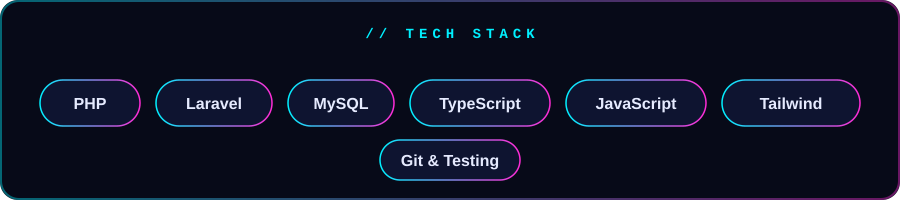

  

<h3 align="center">Hai, saya Bryan 🍥 — Mahasiswa &amp; Web Developer</h3>

  Saya suka membangun aplikasi web yang benar-benar dipakai. Fokus saya di <b>Laravel</b>, <b>TypeScript</b>,
  keamanan aplikasi, dan pengujian otomatis. Seperti ninja yang terus berlatih, saya belajar sedikit demi sedikit
  dan menolak menyerah di tengah jalan.

  

### 🔥 Misi yang sedang dijalankan

- 🧾 **Aplikasi manajemen keuangan kantor**: Laravel + MySQL, persetujuan transaksi, laporan PDF/Excel, hak akses per peran, dan ratusan tes otomatis.
- 🌐 **Web portofolio** berbasis TypeScript → [web-porto](https://github.com/bryanrumuy/web-porto)

### 🌀 Latihan yang sedang diperdalam

`Keamanan aplikasi web` · `Pengujian otomatis` · `Desain antarmuka yang bersih`

> Tulis tes dulu, rapikan kode, dan pastikan aplikasi aman sebelum dipakai orang lain.

  

