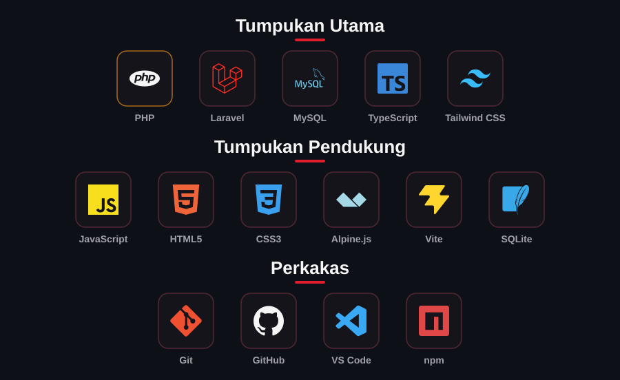
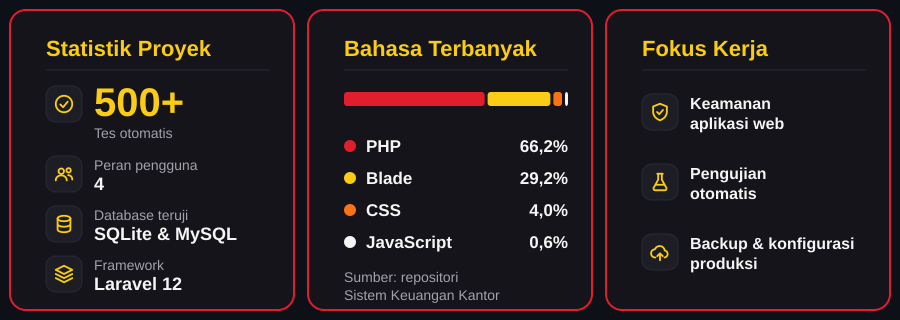
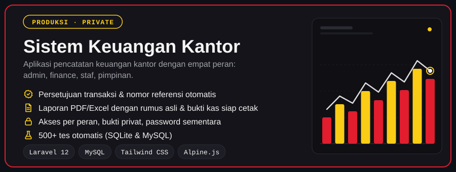

  

Saya web developer yang membangun aplikasi bisnis berbasis web, mulai dari perancangan basis data, alur kerja dan hak akses pengguna, pelaporan, sampai keamanan dan pengujian. Sisi server saya bangun dengan **Laravel** dan **MySQL**, sedangkan antarmukanya dengan **TypeScript**, **Tailwind CSS**, HTML, dan CSS.

Dalam setiap proyek, saya mengutamakan keandalan dan keamanan data: validasi input, pengendalian akses berbasis peran, pengujian otomatis sebelum rilis, serta kesiapan operasional seperti pencadangan data dan konfigurasi produksi. Saya terbuka untuk kolaborasi dan diskusi seputar pengembangan web.

  

  

## Project

  

**Sistem Keuangan Kantor** adalah aplikasi produksi untuk pencatatan keuangan kantor. Repositorinya private karena memuat logika dan data operasional, tetapi garis besar rancangannya sebagai berikut.

| Area | Penjelasan |
|---|---|
| **Peran pengguna** | Empat peran: admin, finance, staf, dan pimpinan. Staf hanya melihat transaksinya sendiri, finance mencatat dan menyetujui, pimpinan memantau, admin mengelola akun. |
| **Alur transaksi** | Uang masuk dan uang keluar melalui persetujuan finance, dengan nomor referensi otomatis, kategori, departemen, dan anggaran per departemen. Saldo awal terbawa antar bulan. |
| **Dokumen** | Laporan PDF dan Excel dengan rumus Excel asli (bukan angka tempelan), buku kas, serta bukti kas siap cetak lengkap dengan terbilang dan kolom tanda tangan. |
| **Keamanan** | Bukti transaksi disimpan privat, password sementara dari admin dengan kewajiban ganti saat login pertama, header keamanan, pembatasan laju, dan penguncian data pada proses yang bersamaan. |
| **Kualitas** | Lebih dari 500 tes otomatis yang dijalankan pada SQLite dan MySQL, termasuk tes hak akses untuk setiap peran. |
| **Kesiapan operasional** | Backup terenkripsi terjadwal beserta pemantauannya, serta konfigurasi produksi yang dipisahkan dari kode (berkas `.env` tidak ikut repositori). |

  

**[web-porto](https://github.com/bryanrumuy/web-porto)** adalah web portofolio pribadi berbasis TypeScript.

## Cara Kerja

1. **Pahami proses bisnisnya** sebelum menulis kode, termasuk siapa melakukan apa dan siapa boleh melihat apa.
2. **Tulis tes untuk perilaku penting**, terutama hak akses dan perhitungan keuangan.
3. **Periksa keamanan sebelum rilis**, bukan sesudahnya.
4. **Dokumentasikan keputusan** supaya aplikasi mudah dirawat orang lain.

  

